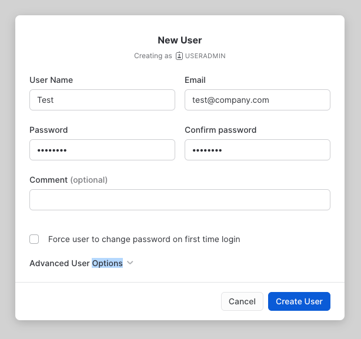

# Snowflake - Terraform example

## Get Trial accounts

### Snowflake 

Snowflake gives some credit for whoever wishes to tinker with it, and given what we'll set up, it is unlikely to ever reach billing.

https://docs.snowflake.com/en/user-guide/admin-trial-account.html

### Amazon

We'll create a few AWS resources, again nothing likely to go over the free tier allowance.

https://aws.amazon.com/free/

If you have an existing account, then make sure the IAM role you'll enter has the permissions to work with S3 buckets. 
If you have never worked with aws & you're not interested, you can
- Comment out all code related to external tables and storage integration in Snowflake
- Or create a free tier and use root keys (no restrictions) 

## Installs

### Terraform

https://developer.hashicorp.com/terraform/downloads

```shell
brew tap hashicorp/tap
```
```shell
brew install hashicorp/tap/terraform
```

This guide was made with `Terraform v1.3.6`.

### Tfswitch

If this guide is using a different version of terraform than your current deployment, you can use `tfswitch` to conveniently go from one version to another: 

https://tfswitch.warrensbox.com/

### Terragrunt

```shell
brew install terragrunt
```

## Setup Terraform

This guidance is here purely for convenience, it is likely to go out of date, and when in doubt, [check out the provider page](https://github.com/Snowflake-Labs/terraform-provider-snowflake).

### Locally (MacOS)

Generate a new key (skip if you are using password authentication to Snowflake).

See file [provisioning_user_rsa.sh](provisioning/provisioning_user_rsa.sh)

Then add necessary config to ~/.zshrc, or export.

See file [.snow.env](provisioning/.snow.env)

### In Snowflake 

see file [provisioning_user_sf.sql](provisioning/provisioning_user_sf.sql)


# FAQ 

- Import an existing resource

Test it by creating manually a user (with the right admin user).



Requires creating the wanted configuration first in Terraform:
```shell
resource "snowflake_user" "test_import_user" {
  provider             = snowflake.admin_security
  # more args
}
```
then it can be imported
```shell
terraform import module.snowflake.snowflake_user.test_import_user NAME_OF_USER_IN_SNOWFLAKE
```